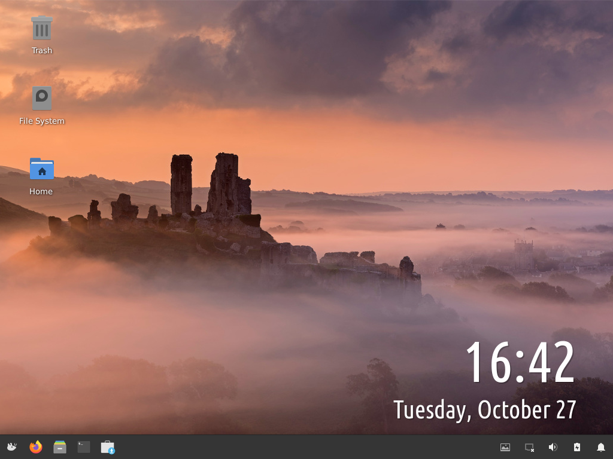

# Rawson linux

This is Rawsonlinux 20 "Neptune"

it was created by Darin Rawson and Alex Rawson

To update Rawsonlinux run Rawsonlinux-update as a non root user

This will not update any packages via apt.

Check out Rawson Linux website
https://sites.google.com/view/rawsonlinux/home

install-files contains the install files for Rawsonlinux

full-install-files contains the boot splash screen and the release files

Rawsonlinuxscripts contains the scripts for Rawson Linux

To install run the install script as a non root user

to completely install rawsonlinux run the script full-install

Or use a disk image from our website
